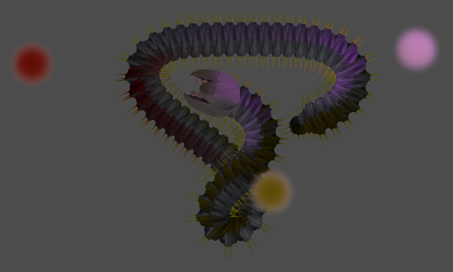
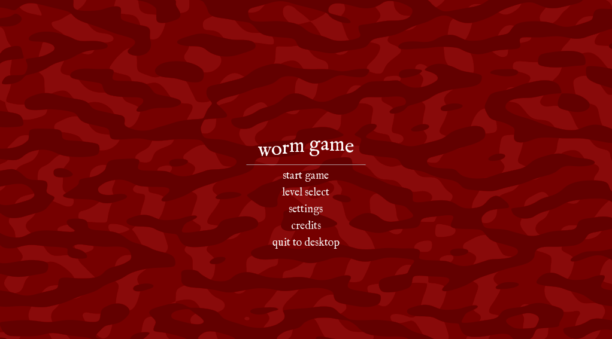
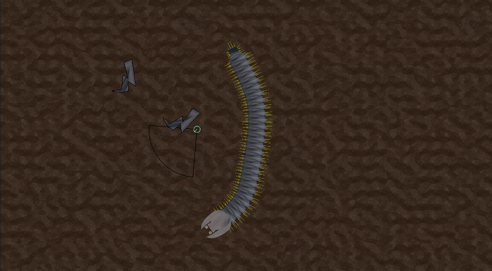

# worms

This is a game I'm building where you play as an ancient being of immense strength - a sandworm. You've awoken
and found that humans have taken the world. You must destroy them in order to nest and survive. 

As a sandworm, use your gaping maw to devour your prey to grow and repair yourself. Avoid damage to your head and
midsection. A destroyed segment will split you in half, but a broken head is instead death! Use the Earth to your
advantage as you dive underground to avoid enemies, and above to attack. Await for their footsteps to approach before
moving in for the kill!

The game is currently in a pre-alpha state. Many additions to assets including sounds, art, and music need to be made.
Additionally, core functionality like level select, proper level transitions, and save files are still missing. After
these omissions are addressed, I plan to release a playable demo here and on itch.

My favourite part of working on the game so far has been modelling the worm. I wanted a cool looking sandworm, and I was
inspired by the sandworm from the movie, Beetlejuice. I modelled the worm in Blender, and to bird's eye renders of each
segment. I generated normal maps for these segments, and combined them to have a model looks 3D in a 2D game, and is 
capable of having lighting effects applied to it. I look forward to created interesting creatures to be fought and expanding
on the tools the player has to defeat them with.

## Acknowledgements

This project would not have been possible without the open source code worm controller code. That code has been heavily
modified. However, the core code for controlling the worm segments depends on it. My contribution was adding collisions
with other physics bodies that worm as expected (you stop when you hit a wall, you apply impulses to other physics bodies, etc.).
